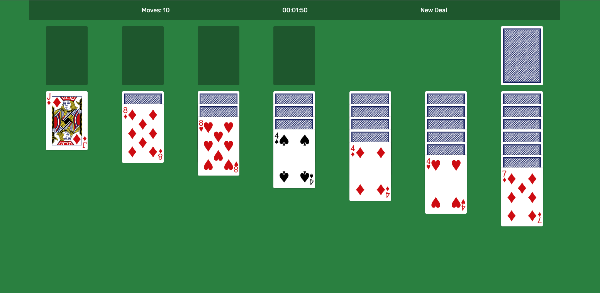
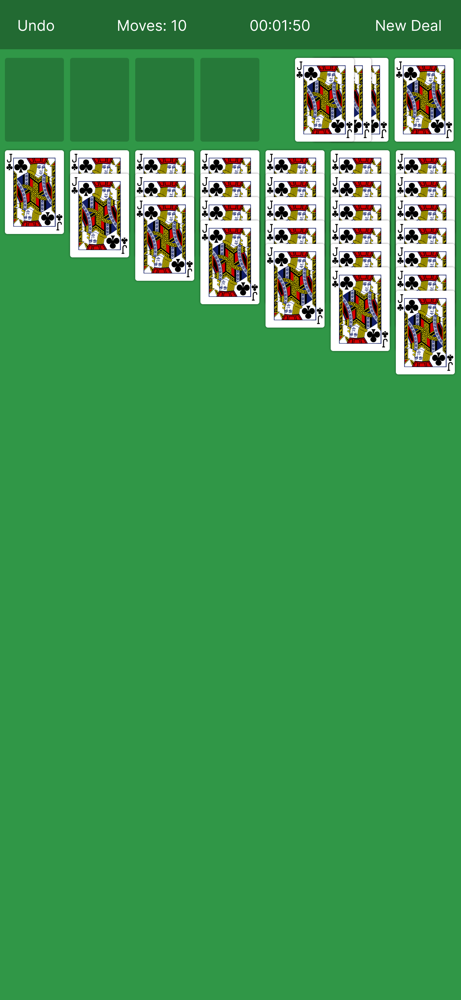

    
    <h1>Solitaire</h1>
    <h3><a href="https://toastito.github.io/solitaire/" target="_blank">Play</a></h3>
    <h3>Roger Davila</h3>
         
    

# About the Game
Solitaire is a single player game with many variations. This flavor of solitaire is Klondike, where the goal is to arrange the cards into four piles from Ace to King using a standard 52 card deck of playing cards.

# How to Play the Game
There are four main section sections to the board.
### 1. The Foundation
This where your cards are sorted. The Foundation piles are initially empty. They are stacked starting with the ace and are built up one card at a time up to the king within the same suit. The game is won when all of your cards are in the Foundation.
### 2. The Tableau
In the Tableau, you can only place a card whose rank is one lower and of an alternate color than the card that it will be placed on top of. You may also move a stack from the Tableau using the card selected as the reference and then moving all of the cards below it to the new position.
### 3. The Hand
This is where you will draw from to get more cards to make more moves. This version of the game deals 1 card at a time from the Hand (deck) when you click it. The drawn cards are placed into the Waste pile in the order they were drawn. Once the hand is empty turn the waste pile over and at it to the hand.
### 4. The Waste
The Waste is where your drawn cards go. Turn over the card(s) you pull from the Hand and stack them on top of each other faceup. You can only access the top most card on the waste, but can see the 3 most recent cards drawn.

 :art: Wireframes

I Used figma to quickly sketch up a wireframe for the application. Focused on making it playable on mobile devices first as I imagined this being a more enjoyable and likely use case.

| Landing Page | Wireframe |
|------------ | ------------|
| <h3 align="center">General Look - iPhone 11 Pro Reference</h3> |  |

## :computer: Technologies Used
 

# Getting Started

[Click to Play Solitaire!](https://toastito.github.io/solitaire/)

## :fast_forward: Next Steps 
### Upcoming Features
- [ ] 3 Card Deal
- [ ] Game Duration Timer
- [ ] Re-Deal Starting Board
- [ ] Undo Move
- [ ] Card Sound Effects
- [ ] Animations
- [ ] Drag Card Function